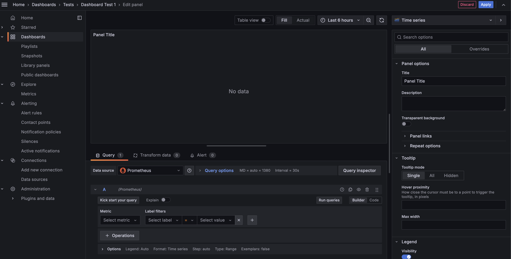
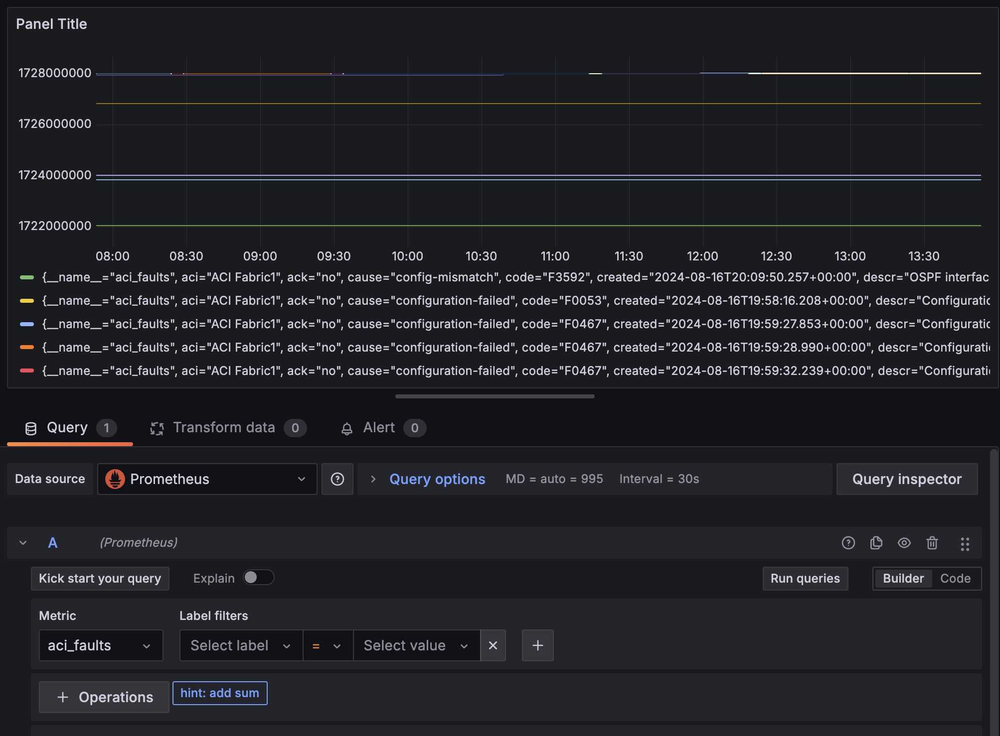
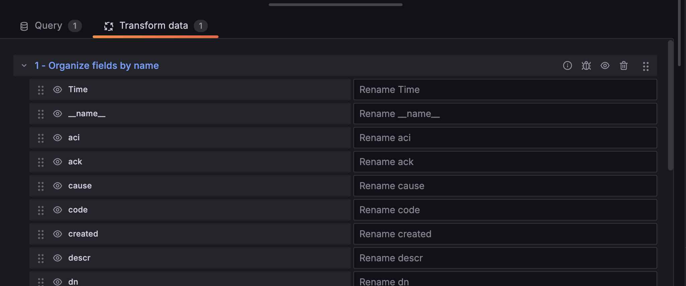

# Overview 

This is an simple lab that builds a minimal dashboard showing data in a Table Format. 

**This labs assumes you are familiar with the [Demo Environment](../demo-environment.md)**

# Access 

The Demo environment is hosted in a DMZ and ca be accessed with the following credentials:

https://64.104.255.11/

user: `guest`
password: `guest`

The guest user is able to modify the dashboards and run `Explore` queries however it can't save any of the configuration changes. 

# Recreate the ACI Faults Dashboard

This dashboard is a 1:1 copy of the faults that are present inside ACI. The main advantages compared to looking at the faults in the ACI UI are:
-  the ability to aggregating Faults from Multiple Fabrics in a single table
-  allowing advanced sorting and filtering

By using the `Fabric` drop down menu you can select different Fabrics (or All) and you can use the Colum headers to filter/sort the data:

This is a good dashboard to understand how Grafana dashboards are built, so let's re-built the `Fault By Last Transition` table. 

**Note:** In this example we are focusing on Grafana Dashboard, *someone* configured the `aci-exporter` and `Prometheus` to populate the `aci_faults` with data. If you wanna learn on how to configure the `aci-exporter` and `Prometheus` to work together you can check out the [development](development.md) guide.

## Dashboard Editing

*Warning:* Since this is an environment open to the internet I have not allowed used to save any config changes so DO NOT close or reload the browser or you will loose your work !

- Select `Dashboards` --> `Tests` --> `Dashboard Test 1` --> Move your move over the empty dashboard --> press `e` on the keyboard. This should open up the editing mode.
- Ensure that you have:
  - `Prometheus` selected as Data Source
  - Selected the `Builder` mode this is a good way to learn but we will also look a the code afterwards.

- From the Metric Drop Down menu select `aci_faults` and click `Run Query` this will display a Graph, in the legend you can see that for each metric we have infos about the Fabric, cause, description etc... the Metric value itself (the 1.7Bil) is the Unix Time Stamp of the last transition time the fault.
  

However this is not a very good visualization for this type of data, we can see interesting data in the legend but a time series is really not the right visualization as we are interested in a list of faults aka a table!

To switch to a `Table` view we need two steps:
-  Select the `Table Format` for our query: Go to `Options` --> `Format` --> Select `Table`

-  Select the `Table` from the Visualization drop down Menu by clicking on `Time Series` and then picking `Table` (take a moment to see how many options there are here)

      

- With just these two simple changes the data should look much better already however:
  - The `Time` and `created` column are not the last transition time for the Fault but when the fault was first received in `Prometheus` and for our use case this is useless.
  - The table contains a few "useless" column that would be nice to hide
  - The `Value` (last column) that represent the last transition time for our `Fault` is a long number, not a date

To solve all these issue we need to manipulate our data, in this example we are going to use there 3 Grafana transformations:

  - `Organize fields by name`: This will allows us to rename, re-order and hide the table columns:
  - `Convert field type`: This will allow us to convert the `Value` from a Unix Time Stamp to an actual human readable data
  - `Sort by`: To sort our Events by Last Transition time i.e. `Value`
  - click on the  `Transform Data` tab and select `Add Transformation` 

## Organize fields by name:

Select `Transform Data` --> `Add Transformation` --> `Organize fields by name`

Here you can 
- Change the ordering of the fields, by drag them by the vertical dots on the left
- Hide them, by clicking on the `eye` symbol
- Rename them by adding text in the empty box on the right of the field name

You are free to sort things as you please but I would recommend to at least:
- Hide:
  - Time
  - aci
  - created
  - instance 
  - job
- Rename:
  - `Values` to `Last Transition`
  - Place `Last Transition` as first item in the table

## Convert field type:

Select `Add another transformation` --> `Convert field type`
- Field: `Last Transition`
- Type: `Time`

If you have placed the `Last Transition` as the first colum you should now see dates but you probably also notice that are not quite right as they show 1970.
This is due to the fact that the epoch is expected in milliseconds since 1970 but what we are getting is just seconds, we will fix this after for now ignore this. 

## Sort by:

Select `Add another transformation` --> `Sort By`
- Field: `Last Transition`
- Reverse: Enabled

Depending on how you have Organize the fields our table should look something like this:

## Fix the `Last Transition` timestamp:

All we have to do is multiple the `Last Transition` (aka the Value of our Metric) by 1000

- Click on `Query` --> `+ Operations`
- In the `Search` tab enter `multiply` and select `Multiply by scalar`

- Set the `Value`: to 1000
- Click `Run Queries` 

Now the time should be reflected correctly. 

## Switch to Code

The query Builder is a great tool to learn but as you star building more complex queries it will become too cumbersome to use and some advanced capabilities are also not available so is a good idea to also learn the `PromQL` syntax. Try to click on `Code` and you should see that the same expression can be written as: 

`aci_faults * 1000`

## Filter by Fabric

We will do this steps in the Code mode to learn a bit more. `PromQL` support filtering your queriers by the labels, this is super easy, just open a `{` after the metric name and you should see a dropdown menu with all our labels!

If you want for example to show Faults only from `site1` you can type the following query `aci_faults{fabric="site1"} * 1000` and now only faults from `site1` should appear. If you want to filter by using Regular Expressions (`RegEx`) you can replace `=` with `=~` we will use this syntax in the next task

## Filter by Fabric with Dashboards Variables

Variables in Grafana allow you to create dynamic and interactive dashboards by enabling you to define placeholders that can be replaced with different values at runtime.

If you are still on the dashboard editing pane let's modify our query to look like this:

`aci_faults{fabric=~"$fabric"} * 1000`

The `fabric=~"$fabric"` part simply tells `Grafana` to use the variable `$fabric` in this filter and the `=~` also allow us to treat this filtering expression as a `RegEx` so that we can select 1 or more fabrics at the same time. 

Click apply, this will result in an *empty* dashboard, this is expected since the  variable `$fabric` does not exists yet!

To create the `$fabric` variables to select our `sites` follow these steps:

- Click on the gear icon (settings in the top right) and select "Variables."
- Click "New variable"
  - Select variable type: `Query`
  - Name: `fabric`
  - Display Name: `Fabric`
  - Show on dashboard: `Labels and Values`
  - Data source: `Prometheus`
  - Query
    - Query type: `Labels Values`
    - Label: `fabric` **Warning** select the `fabric` label **DO NOT** select `$fabric`
  - Selection options: Enabled `Multi-Values` and `Include All option`
- Click `Apply`
- Click `Close`
- If the Dashboard is still empty click the refresh button on the Top Right (the two spinning arrows)

Now your dashboard will have a new drop down menu where you can dynamically select the fabric to display!

# The End
This concludes Lab1, feel free to play around more with this dashboard if you want or you can proceed to [Lab2](lab2.md)